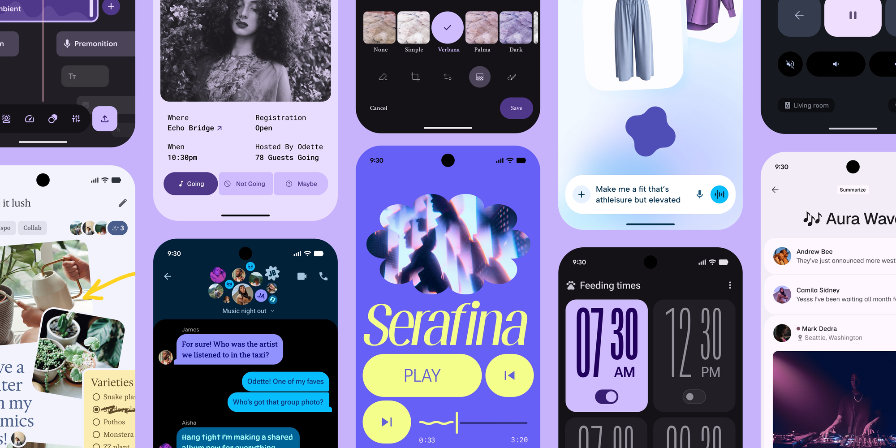

# Material Design 3 Skill

**Version 1.1.1 · released 2026-06-29** — Fixes Claude Code installation by shipping a plugin marketplace manifest; documents the working install commands.

A comprehensive skill for AI coding assistants that can load `SKILL.md` files, covering Google's [Material Design 3](https://m3.material.io/) (Material You) UI system.

[](https://m3.material.io/)

---

## What's new

### 1.1.1 — 2026-06-29

**Fixed — Claude Code installation.**

- The repo now ships a plugin **marketplace manifest** at `.claude-plugin/marketplace.json` and moves the plugin manifest to `skills/material-3/.claude-plugin/plugin.json`. Previously the documented `claude plugin install github:hamen/material-3-skill` failed with *"not found in any configured marketplace"* ([#8](https://github.com/hamen/material-3-skill/issues/8)).
- Documented the install paths that actually work — `npx skills` and the Claude Code marketplace flow (see [Installation](#installation)).
- **Migration**: if you installed (or tried to) with the old `claude plugin install github:hamen/material-3-skill` command, reinstall with one of the commands in [Installation](#installation).

Read the full release notes: [v1.1.1](https://github.com/hamen/material-3-skill/releases/tag/v1.1.1).

### 1.1.0 — 2026-05-20

**Updated — Google I/O 2026 Material guidance.**

- Added notes from [What’s new at Google I/O 2026](https://m3.material.io/blog/whats-new-at-io26): Expressive layout/scaffold, the 8dp spacing system, watch/XR form factors, expressive lists and menus, Compose-first Material Android, and expressive search/search app bar.

Read the full release notes: [v1.1.0](https://github.com/hamen/material-3-skill/releases/tag/v1.1.0).

### 1.0.0 — 2026-05-20

**Added — portable skill packaging.**

- **Claude Code one-command install**: install directly with `claude plugin install github:hamen/material-3-skill`.
- **Portable skill layout**: the skill now lives at `skills/material-3/SKILL.md`, with references under `skills/material-3/references/`.
- **Plugin manifest**: `.claude-plugin/plugin.json` declares the `material-3` plugin metadata for Claude Code while keeping the skill content usable by other skill-aware assistants.

> **Superseded in 1.1.1.** The `claude plugin install github:…` command above never worked and the plugin manifest has moved — use the current commands in [Installation](#installation).

Read the full release notes: [v1.0.0](https://github.com/hamen/material-3-skill/releases/tag/v1.0.0).

---

## Table of contents

- [What's new](#whats-new)
- [What it does](#what-it-does)
- [Platform support](#platform-support)
- [How this skill was built](#how-this-skill-was-built)
  - [Sources](#sources)
  - [Process](#process)
  - [What this means for accuracy](#what-this-means-for-accuracy)
- [Installation](#installation)
- [Usage](#usage)
  - [Build MD3 components](#build-md3-components)
  - [Generate a theme](#generate-a-theme)
  - [Scaffold an app](#scaffold-an-app)
  - [Audit MD3 compliance](#audit-md3-compliance)
- [What's included](#whats-included)
- [Contributing](#contributing)
- [License](#license)

## What it does

- Guides AI coding assistants in generating **MD3-compliant UI** with correct design tokens, components, theming, layout, and accessibility
- **Primary focus: Jetpack Compose** — `MaterialTheme`, Material 3 composables, adaptive layouts, edge-to-edge/insets, and current Compose Material3 patterns
- Also covers **Flutter** (`useMaterial3`, `ColorScheme.fromSeed`, etc.) at a secondary level
- **Web (`@material/web`)** is documented as a **limited** path: [Material Web is in maintenance mode](https://m3.material.io/develop/web) and **M3 Expressive is not implemented on Web**; use tokens and components knowing the ecosystem is not receiving active feature work
- Covers **30+ components** with Compose-oriented mappings plus web element names where applicable, attributes, and examples in `skills/material-3/references/component-catalog.md`
- Includes an **MD3 compliance audit** mode that scores apps across 10 categories (works for Compose/Kotlin, Flutter/Dart, and web/CSS)
- Covers **M3 Expressive** plus the **Google I/O 2026** layout/component updates — see [SKILL.md](skills/material-3/SKILL.md), [layout-and-responsive.md](skills/material-3/references/layout-and-responsive.md), and [typography-and-shape.md](skills/material-3/references/typography-and-shape.md)

## Platform support

| Platform | Role in this skill | Notes |
|----------|---------------------|--------|
| **Jetpack Compose** | **Primary** | Best match for current Material 3 implementation APIs, Expressive motion where available, adaptive navigation |
| **Flutter** | Secondary | `ThemeData(useMaterial3: true)`, `ColorScheme.fromSeed`, community packages for dynamic color |
| **Web** | Limited | `@material/web` + CSS custom properties; maintenance mode; no full Expressive parity |

## How this skill was built

This skill was created collaboratively between a human and an AI coding agent. The information in the skill files is **distilled from publicly available sources** — it is not original design system documentation, but a curated reference assembled from official docs, library references, and training data.

### Sources

Design token values, component specs, layout breakpoints, color roles, typography scales, and implementation patterns were gathered from:

- **[m3.material.io](https://m3.material.io/)** — Google's official Material Design 3 documentation
- **[What’s new at Google I/O 2026](https://m3.material.io/blog/whats-new-at-io26)** — Expressive layout, spacing, lists, menus, search, watch/XR, and Compose-first Android updates
- **[Android Developers — Material Design 3 in Compose](https://developer.android.com/develop/ui/compose/designsystems/material3)** and **AndroidX Compose Material3** API references
- **Model training data** — publicly available Material Design documentation, Flutter and Jetpack Compose documentation, `@material/web` references, and community guides
- **[@material/web](https://github.com/material-components/material-web)** — used to verify web component element names, attributes, and import paths where web guidance is included

### Process

1. **Planning phase** — Main `skills/material-3/SKILL.md` plus focused reference files under `skills/material-3/references/`.

2. **Live site research** — m3.material.io is often a JavaScript-rendered SPA; browser automation helps verify current token values, component lists, and Expressive updates.

3. **Cross-referencing** — Official Compose and Flutter docs fill in copy-paste APIs; web sections stay secondary.

4. **Distillation** — Token tables, component templates, and layout examples normalized for consistency.

5. **Audit system** — 10-category MD3 compliance audit adaptable to Compose, Flutter, or web source trees.

### What this means for accuracy

The skill is a **best-effort distillation** and may drift as Google updates the spec.

- **Compose** guidance is prioritized for currency; prefer official Android docs for exact API signatures and BOM versions.
- **Web**: Material Web is [in maintenance mode](https://m3.material.io/develop/web); M3 Expressive is **not** on Web. Examples may lag; verify against the [material-web](https://github.com/material-components/material-web) repo.
- **M3 Expressive** (motion, emphasized type, shape morphing, new radii) varies by platform — see the Expressive sections in [SKILL.md](skills/material-3/SKILL.md).
- Contributions and corrections are welcome.

## Installation

### Recommended: `npx skills`

```bash
npx --yes skills add hamen/material-3-skill --skill material-3 -y
```

This is the preferred path for Codex, Claude Code, Cursor, and multi-agent setups because the repo follows the direct `skills/<name>/SKILL.md` layout.

### Claude Code plugin install

Add this repository as a plugin marketplace, then install the `material-3` plugin from it.

From inside an interactive Claude Code session:

```text
/plugin marketplace add hamen/material-3-skill
/plugin install material-3@material-3-skill
```

Or from your shell:

```bash
claude plugin marketplace add hamen/material-3-skill
claude plugin install material-3@material-3-skill
```

The root `.claude-plugin/marketplace.json` points at `skills/material-3`, where Claude Code reads `.claude-plugin/plugin.json` and registers `SKILL.md`.

### Codex or manual skill install

Clone the repository, then link or copy `skills/material-3` into the skills directory your assistant reads:

```bash
git clone https://github.com/hamen/material-3-skill.git
cd material-3-skill

# Codex
mkdir -p ~/.codex/skills
ln -s "$(pwd)/skills/material-3" ~/.codex/skills/material-3

# Other SKILL.md loaders
ln -s "$(pwd)/skills/material-3" /path/to/your/skills/material-3
```

## Usage

### Build MD3 components

```
/material-3 component Create a login form with email and password fields
```

### Generate a theme

```
/material-3 theme Generate a theme from seed color #1A73E8
```

### Scaffold an app

```
/material-3 scaffold Create a responsive app shell with navigation
```

### Audit MD3 compliance

```
/material-3 audit [URL or file path]
```

The audit scores your app across 10 categories (color tokens, typography, shape, elevation, components, layout, navigation, motion, accessibility, theming) and produces a detailed report with specific fixes. Targets may be **Compose/Kotlin**, **Flutter**, or **web** — see [SKILL.md](skills/material-3/SKILL.md) for per-stack checks.

## What's included

| File | Description |
|------|-------------|
| `.claude-plugin/marketplace.json` | Claude Code marketplace manifest, points at the `material-3` plugin subdir |
| `skills/material-3/.claude-plugin/plugin.json` | Claude Code plugin manifest for the `material-3` skill |
| `skills/material-3/SKILL.md` | Main skill: philosophy, decision trees, token overview, component table, Compose-first notes, limited web patterns, audit procedure |
| `skills/material-3/references/color-system.md` | Color roles, tonal palettes, dynamic color, baseline schemes (Compose + CSS) |
| `skills/material-3/references/component-catalog.md` | Components with Compose mappings and `@material/web` where applicable |
| `skills/material-3/references/theming-and-dynamic-color.md` | Theme generation, brand colors, dark mode — Compose first, then Flutter and web |
| `skills/material-3/references/typography-and-shape.md` | Type scale, shape, elevation, motion — including Expressive platform notes |
| `skills/material-3/references/navigation-patterns.md` | Nav selection, Compose-first patterns, responsive shell |
| `skills/material-3/references/layout-and-responsive.md` | Breakpoints, canonical layouts, edge-to-edge/insets, foldables |
| `CONTRIBUTING.md` | How to contribute without drifting the Compose-first story |

## Contributing

See [CONTRIBUTING.md](CONTRIBUTING.md) for platform hierarchy (Compose-first), Expressive rules, and a PR checklist so documentation stays consistent.

## Made by

I'm **Ivan** — Android dev, creator of this skill. When I'm not writing Compose
tooling, I ship small apps. If this saved you time, take one for a spin:

- 🎯 **[3 Things a Day](https://3things.day/?utm_source=github&utm_medium=readme&utm_campaign=material_3_skill)** — pick 3 things, finish them. That's the app.
- 💪 **[StreakUp](https://streakup.fit/?utm_source=github&utm_medium=readme&utm_campaign=material_3_skill)** — push-up, squat & pull-up streak tracker.
- 🌙 **[Bedtime Stories](https://bedtimestories.click/?utm_source=github&utm_medium=readme&utm_campaign=material_3_skill)** — AI bedtime stories your kid helps build.
- 🃏 **[Blackjack Trainer 21](https://trainblackjack.app/?utm_source=github&utm_medium=readme&utm_campaign=material_3_skill)** — learn perfect basic strategy with spaced repetition.
- 📚 **[Ebooks for Kindle](https://kindlegratis.fun/?utm_source=github&utm_medium=readme&utm_campaign=material_3_skill)** — free Kindle book deals, updated daily.
- 🏊 **[Swimming Lane](https://swimminglane.app/?utm_source=github&utm_medium=readme&utm_campaign=material_3_skill)** — swim lap & workout tracker.
- 🥫 **[No Waste Food](https://nowastefood.app/?utm_source=github&utm_medium=readme&utm_campaign=material_3_skill)** — track your pantry, stop wasting food.
- 📱 **[Brainrot Tax](https://brainrottax.app/?utm_source=github&utm_medium=readme&utm_campaign=material_3_skill)** — a reality check on your screen time.
- 🖼️ **[Epic AI Wallpapers](https://cwti-ltd.github.io/ai-wallpapers/?utm_source=github&utm_medium=readme&utm_campaign=material_3_skill)** — fresh AI wallpapers, every day.
- 🧠 **[MyGoo](https://mygoo.fun/?utm_source=github&utm_medium=readme&utm_campaign=material_3_skill)** — daily trivia quiz game (Italian).

Find me at [ivanmorgillo.com](https://ivanmorgillo.com/?utm_source=github&utm_medium=readme&utm_campaign=material_3_skill) · [@hamen](https://x.com/hamen).

## License

MIT
